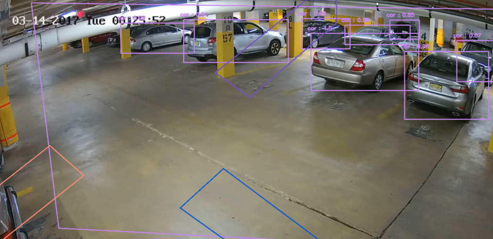

# 

  

**RePlaced** est un projet étudiant, réalisé en quelques semaines, avec pour but de rendre l'accès et la localisation plus simple, et au plus grand monde. Grâce aux APIs OpenData, aux caméras en libre accès, et l'intelligence artificielle, **se garer devient plus simple** !

## L'application RePlaced

### Description :
RePlaced est une application pour Android (pour le moment). Pour trouver une place de parking libre près de soi, rien de plus simple que d'utiliser RePlaced ! Elle détecte automatiquement votre position. Quand vous voyez une marque apparaitre sur la carte, vous n'avez plus qu'à cliquer dessus pour réserver la place et vous y rendre.

### Fonctionnalités :
- Disponibilité des places de parking en temps réel :
  - L'utilisateur peut avoir en quelques secondes une vue d'ensemble des parkings disponibles autour de lui.
- Réservation d'une place de parking :
  - Quand une place est reservée, elle n'est plus proposée aux autres utilisateurs de l'application.
- Inscription/Connexion :
  - Dans les paramètres, vous pourrez vous inscrire et vous connecter pour pouvoir, plus tard, réserver une place.
- Thèmes d'application :
  - L'utilisateur peut passer l'application en mode clair ou sombre.
- Itinéraire :
  - L'utilisateur peut à tout moment lancer l'itinéraire sur *Google Maps* afin de se rendre à une place de parking spécifique.
- Place de parking la plus proche
  - A l'aide du bouton *loupe* sur l'application, la place la plus proche de l'utilisateur est automatiquement trouvée et affichée.

## Intelligence artificielle & APIs
RePlaced se base en partie sur une technologie d'analyse d'images par intelligence artificielle. Elle récupère des flux vidéos de caméras de surveillance publiques, en extrait l'aperçu toutes les minutes et l'analyse. Ensuite, dans l'application, ces marqueurs, correspondant aux caméras, seront affichés en rouge. D'autres types de marqueurs sont aussi présents, des marqueurs bleus. Ils représentent les parkings dont les données sont récupérées via des APIs (OpenData). La carte est donc actualisée en temps réel !

**Les OpenData actuellement utilisées** :
- [Lille](https://opendata.lillemetropole.fr)
- [Marseille / Aix-en-Provence](https://data.ampmetropole.fr)
- [Montpellier](https://portail-api-data.montpellier3m.fr)

## Installation
Vous pouvez installer l'application sur votre appareil Android grâce à l'APK via [le répertoire GitHub](./RePlaced-Website/RePlaced.apk) directement ou via notre [site web RePlaced](http://51.75.142.229:3001/).
Il suffit ensuite d'ouvrir le fichier sur téléphone via l'explorateur de fichiers, et de le lancer dans `Programme d'intstallation Kit`.

